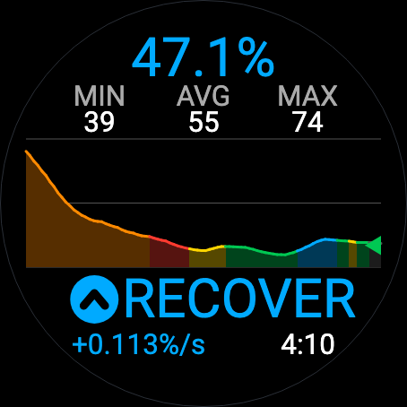
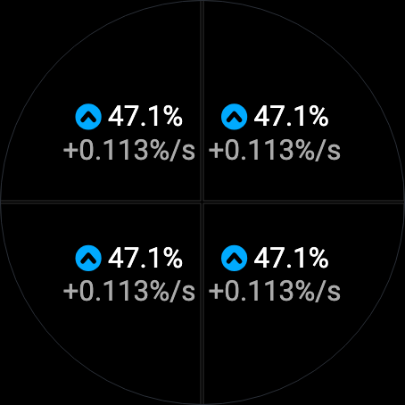
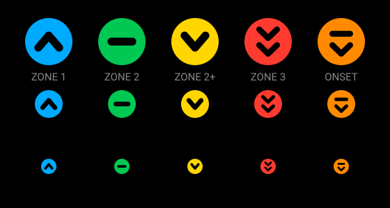

# SmO2 Control — Steady-State Intensity Monitor

A Garmin Connect IQ data field that reads a **Moxy** muscle-oxygen sensor over
ANT+ and answers one question in real time:

> **Am I in steady state, or am I still drifting down?**

Not "SmO2 = 34 %". The absolute number is nearly meaningless between sessions.
What matters is the *kinetics*: how fast SmO2 falls when an interval starts,
whether it reaches a plateau, and how quickly it recovers.

## What it shows



| State | Colour | Meaning |
|---|---|---|
| **RECOVER** | blue | Rising, recovery or the effort is too easy |
| **HOLDING** | green | Flat, supply matches demand, a sustainable steady state |
| **ONSET** | orange | Rapid desaturation, the on-transient at interval start |
| **DRIFTING** | yellow | Slow decline, demanding but still controlled |
| **FALLING** | red | Decline continuing, no steady state exists here |

The labels name the behaviour that was measured. The kinetic terms
(REOXY / STEADY / ON-KIN / CONTROL / OVER) are a setting away.

Zone numbers are deliberately absent: the watch already owns that word for its
own heart rate and power zones, and more importantly a zone is a claim about
intensity while this field measures a slope. A plateau occurs below LT1 and at
threshold alike, so no mapping from slope to zone can be correct without the
athlete's own oxygenation breakpoints.

The distinction that matters most is **ONSET vs FALLING**. Every hard interval
starts with a steep fall; that fall is not a verdict. What separates a
sustainable interval from an unsustainable one is whether the plateau arrives
after it.

## Requirements

- A Moxy (or other ANT+ Muscle Oxygen profile sensor)
- A Garmin device with an ANT+ radio — see `manifest.xml` for the list

> **Important:** do **not** pair the Moxy natively in the watch's sensor list.
> A sensor can only hold one ANT channel. This data field opens its own, because
> SmO2 has never been part of the native Connect IQ sensor API — if the watch
> grabs the channel first, the field will sit in `SEARCH` forever.

A watch has one 2.4 GHz radio, shared between ANT and Bluetooth, and a
*searching* ANT channel keeps its receiver on almost continuously. So the
reopen after a lost or never-found sensor backs off: 2, 4, 8, 16, 32 s, then a
60 s ceiling, reset the moment a broadcast arrives. Reopening immediately, as
the first version did, left the field searching for the whole activity
whenever the sensor was off, and that is enough to break BLE headphone audio.

## How it works

Two estimators on two timescales, because one cannot do both jobs:

```
raw SmO2 (~1 Hz, noisy)
      |
      +-- Holt double-exponential smoothing --> level, fast trend (%/s)
      |                                          `-- forecast, chart
      |
      +-- 60 s rolling least-squares slope ----> steady-state classification
                                                  `-- the colour
```

**Why not exponential smoothing for the classification too?** Not CPU cost — a
60-sample regression is nothing. It is statistical. On real Moxy data the Holt
trend swings past 0.15 %/s on half of all samples *inside a rock-solid plateau*;
the signal genuinely moves that fast, so no threshold on it separates anything.
Slowing it down does not help either: an exponential filter has an infinite tail
and keeps carrying the on-transient forward, so it never settles within an
interval. A finite window forgets the transient once it slides past, and for
"has the plateau arrived?" forgetting is exactly the feature you need.

All thresholds are measured against five real threshold sessions, not guessed.
With a 60 s window the plateau slope stays inside ±0.06 %/s while the
on-transient runs past −0.23 %/s.

Three defences sit outside the classifier, so the thresholds keep their
measured meaning: a **3-sample median** before the smoother, which outvotes the
isolated spike a Moxy is prone to; a **dropout tolerance** of 8 s, because
clearing a 60 s fit for one invalid reading cost the window plus its 20 s
refill; and a **3-tick dwell** on the verdict, so a slope that steps over a
threshold and back does not show. Measured across three sessions, the dwell
halves the number of state runs shorter than 5 s. A dwell of four halves them
again but costs a short recovery lap 22 points of REOXY, so three it is.

**Nothing needs calibrating.** The verdict is read from the slope, and a slope
in %/s means the same thing at any level, so sensor placement, adipose
thickness, strap pressure and day form drop out of it. What is normalised
within the session is only what gets *reported*: the relaxing session min/max
behind MIN and MAX, and the lap-scoped variants behind the lap button. A
baseline median and a first-lap reference band are also computed, and currently
feed nothing; see
[docs/functionality-en.md](docs/functionality-en.md) section 4.

## Layout

Three tiers, chosen once from the rendered size:

- **Full** — the full-screen and half-screen field only. Filled chart with
  gridlines, lap markers and a forecast needle, framed by two blocks: the SmO₂
  reading with MIN / AVG / MAX as a labelled cell grid above it, and the state
  light with its name, the rate and the external load below it. One block says
  what the reading is, the other what it means, so neither question is split
  across the plot. Rows pack to the edges on a bike computer and inwards on a
  round watch, because on a round watch the tips of the circle cannot hold
  text.
- **Medium / Compact** — everything smaller: a **traffic light** and one
  configurable number as a single centred group, with a second line where
  there is room. A sparkline squeezed into a quarter of a round watch is
  decoration, and it costs the space the number needs.

Every value slot takes the same list, so anything can go anywhere: SmO2, the
rate of change, THb, or the **Control Index** as per cent or as a ratio. Shown
live, the Control Index is the amplitude of the current lap so far, and it
lands on the recorded lap value at the lap press.



The light carries a symbol as well as a colour, so the verdict never rests on
hue alone: one chevron up, a bar, one chevron down, two chevrons down, and a
bar with a chevron falling away from it.



The tier is decided from the *usable* rectangle — on a round watch the corners
of the device context are not on the glass — and from how much of the screen
the field owns. Both are checked against every layout of every supported
device:

```bash
./tools/layout_audit.py     # 5716 field rectangles, no element off-glass or overlapping
```

## Build and run

```bash
./build.sh                 # signed .iq for all devices -> bin/
./simulate.sh              # build + run on fr970 in the simulator
./simulate.sh fenix847mm
```

Set `CIQ_SDK` to override the SDK path. A `developer_key` must be present in
the project root; it is gitignored and not recoverable from the repo.

> The simulator **cannot** feed SmO2 — its FIT playback does not drive generic
> ANT channels. The field will show `SEARCH`. That is expected. For live data
> you need SimulANT+ with an ANT USB stick; for algorithm work use the replay
> tool below.

## Tuning the model on your own data

```bash
./tools/kinetics_replay.py --synthetic          # sanity check, known ground truth
./tools/kinetics_replay.py activity.fit         # your own session
./tools/kinetics_replay.py *.fit                # several at once
./tools/kinetics_replay.py activity.fit --sweep # grid search alpha/beta
```

`tools/kinetics_replay.py` is a faithful Python port of `source/Kinetics.mc`,
and `tools/fitreader.py` is a dependency-free FIT decoder. Reading `.fit`
straight off the watch means you tune against your *own* threshold intervals
rather than guessing.

It breaks the session down per lap and gives a verdict per interval:

```
 per-interval summary
  lap        dur  start    end   drop  ratio     rate    onkin    min    max  verdict
  lap02      359   66.0   46.4  +19.7   0.70   -0.055   -0.404   43.3   66.4  sustainable (steady 78%)
  lap10      360   78.9   35.3  +43.6   0.45   -0.121   -1.635   34.8   79.8  sustainable (steady 51%)
```

`drop` and `ratio` are the two forms of the **Control Index**, the amplitude of
the interval's desaturation: `start − end` in percentage points, and the same
drop as a fraction `end / start`. In a step test the amplitude tracks lactate,
and it is exactly what `rate` throws away by dividing through the duration. It
does depend on the length of the step, so compare steps of equal length.

`rate` is the per-interval desaturation rate ((end − start) / duration);
`onkin` is the steepest slope during the on-transient, which tracks metabolic
rate. All of them are written to the FIT lap fields, so the same analysis
appears in Garmin Connect automatically.

The model is working when your sustainable intervals show real STEADY time and
your hard ones do not. If they do not separate, adjust `theta_stable` first.

Settings map directly:

| Tool | App setting |
|---|---|
| `alpha` | `smoothingAlpha100` (× 100) |
| `beta` | `smoothingBeta100` (× 100) |
| `theta_stable` | `thetaStable1000` (× 1000) |
| `theta_drift` | `thetaDrift1000` (× 1000) |
| `steady_window` | `steadyWindowSec` |

## Recorded to the FIT file

Record fields: smoothed SmO2, trend (%/s), state, THb.
Lap fields: desaturation rate, Control Index (amplitude and ratio),
on-kinetics rate, SmO2 min/max.
Session: average SmO2. All charted in Garmin Connect.

## Project layout

```
source/
  SmO2ControlApp.mc        AppBase — owns the ANT channel
  SmO2ControlView.mc       the data field: compute, layout tiers, rendering
  MoxySensor.mc            ANT+ channel, page 1 parser, backing-off reconnect
  Kinetics.mc              Holt smoothing + rolling regression + classification
  SessionCalibration.mc    baseline, session range, lap calibration
  ChartRenderer.mc         ring buffer + coloured sparkline
  SmO2FitContributor.mc    FIT record/lap/session fields
  Palette.mc               state colours, incl. colour-blind variant
tools/
  kinetics_replay.py       offline model replay and parameter tuning
  fitreader.py             dependency-free FIT decoder
  layout_audit.py          geometry check across every device and layout
docs/paper/
  smo2-control.tex         the model as a paper: formulas, worked examples, plots
  figures.py, build.sh     regenerate figures and numbers from a .fit, build the PDF
design/
  render_field.py          offline SVG render of the field from real .fit data
  icon.svg, icon-mark.svg  store icon and launcher mark
```

## Status

Implemented: ANT link, kinetics, on-transient handling, state classification,
three-tier display, FIT recording, reconnect, lap calibration, per-interval
rates and Control Index, forecast marker, and a load overlay with decoupling
detection.

Not yet implemented: a modelled "SmO2 cost per pace unit", and recovery
overshoot analysis.

Full behavioural reference: [docs/functionality-en.md](docs/functionality-en.md)
(also [in German](docs/functionality-de.md)).

## Licence

MIT — see [LICENSE](LICENSE).
